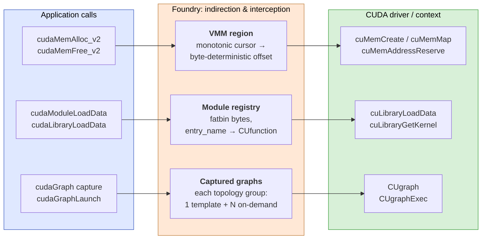

# Foundry

Foundry is a system that persists CUDA graph states through *template-based context materialization*. It materializes both the structure and execution context of captured CUDA graphs, making graph restoration kernel-agnostic and eliminating the need for hand-crafted patching rules. By intercepting CUDA driver calls, Foundry enforces a **deterministic memory layout** and automatically detects and serializes the **binaries of kernels** used in the CUDA graphs.

With Foundry, LLM serving engines can directly reload CUDA states from disk and skip the warmup process to start in a few seconds.

## Foundry in Action


**Baseline vLLM (top) vs. vLLM + Foundry (bottom)**. Foundry reconstructs 256 graphs in **<u>1 sec</u>** (plus ~2 sec sampler warmup + API server init), while orginal vLLM spends around **<u>30 sec</u>** to warmup and capture graphs.

## How it works

Foundry intercepts three classes of CUDA driver calls and routes each through its own piece of in-process state, so SAVE can serialize that state to disk and LOAD can rebuild an identical driver-side state from the archive.



- **Memory.** Every device allocation is funneled into a single VMM region `[base_addr, base_addr + region_size)`. A monotonic cursor gives every tensor a byte-deterministic offset; the underlying physical mapping is done with `cuMemCreate` + `cuMemMap`.
- **Modules / libraries.** As device code is loaded, the fatbin bytes and the `entry_name → CUfunction` table are recorded.
- **Captured graphs.** Each captured `CUgraph` is serialized and then grouped with other graphs that share the same topology. One graph per group is kept as the **template** (a fully built `CUgraphExec`); the rest are stored as **on-demand** graphs that share the template's executor and only carry the per-node parameter overrides needed to switch between them.

**SAVE** writes all three pieces to an archive. **LOAD** pre-maps the same VMM range, re-loads the same modules from the packed fatbins, instantiates one `CUgraphExec` per topology group as template and prepare node-param sets. It later applies node-param updates on demand — kernel handles embedded inside the captured graphs resolve to the same device addresses they had at SAVE time.

## Inference-Engine Integrations

Foundry ships engine integrations under `foundry/python/foundry/integration/`. Per-engine setup instructions live under [`recipe/`](recipe/).

| Engine | Integration code | Documentation | Setup Instructions |
|---|---|---|---|
| vLLM | [`integration/vllm/`](python/foundry/integration/vllm/) | [`docs/vllm/overview.md`](docs/vllm/overview.md) | [`recipe/vllm/README.md`](recipe/vllm/README.md) |
| SGLang | [`integration/sglang/`](python/foundry/integration/sglang/) | [`docs/sglang/overview.md`](docs/sglang/overview.md) | [`recipe/sglang/README.md`](recipe/sglang/README.md) |
| TensorRT-LLM | [`integration/trtllm/`](python/foundry/integration/trtllm/) | [`docs/trtllm/overview.md`](docs/trtllm/overview.md) | [`recipe/trtllm/README.md`](recipe/trtllm/README.md) |

### Status

| Engine | Single GPU | DP | TP | EP |
|---|:---:|:---:|:---:|:---:|
| vLLM | ✅ | ✅ | 🚧 | ✅ |
| SGLang | ✅ | 🚧 | 🚧 | 🚧 |
| TensorRT-LLM | 🚧 | 🚧 | 🚧 | 🚧 |

✅ validated end-to-end (SAVE → LOAD → query) &nbsp;·&nbsp; 🚧 not yet

The adapted vLLM / SGLang / TensorRT-LLM forks will be released alongside this repo at `foundry-org/vllm`, `foundry-org/sglang`, `foundry-org/TensorRT-LLM`.

### Performance

🚧🚧🚧

## Roadmap

See [ROADMAP.md](ROADMAP.md) for the full development plan and progress.

## Requirements

- CMake 4.0+
- PyTorch 2.9.0+
- CUDA Driver 12.0+
- Boost 1.83.0+

If you are using a conda environment, you can install the requirements with the following command:

```bash
conda install -c conda-forge boost-cpp boost
```

## Installation

```bash
pip install cmake # make sure cmake 4.0.0 +
# re-enter env
conda deactivate 
conda activate xxx
# Torch 2.11 with CUDA 13.0
pip install torch==2.11.0 torchvision==0.26.0 torchaudio==2.11.0 --index-url https://download.pytorch.org/whl/cu130
pip install -e . --no-build-isolation
```

## Quick Start

### Graph Capture and Save

Foundry requires LD_PRELOAD to intercept CUDA driver calls. The graph capture and save must run in a subprocess with the hook library preloaded.

```python
import foundry as fdry
import torch

torch.cuda.init()
device = torch.device('cuda:0')
torch.set_default_device(device)

# Set up VMM allocation region for deterministic memory addresses
BASE_ADDR = 0x7f0000000000
region_size = fdry.parse_size('1GB')
fdry.set_allocation_region(BASE_ADDR, region_size)

# Allocate input tensors
input_a = torch.full((100, 100), 2.0, device=device)
input_b = torch.full((100, 100), 3.0, device=device)

# Warm up the model
model = MyModel()
model(input_a, input_b)
torch.cuda.synchronize()

# Capture CUDA graph
graph = fdry.CUDAGraph()
with fdry.graph(graph):
    result = model(input_a, input_b)

# Replay and verify
graph.replay()
torch.cuda.synchronize()

# Save graph with output tensors
# Produces BOTH graph.json and graph.cugraph (optimized binary format)
graph.save('graph.json', output_tensors=result)

fdry.stop_allocation_region()
```

### Graph Load and Replay

Loading a saved graph also requires LD_PRELOAD and must use the same allocation region base address.

```python
import foundry as fdry
import torch

torch.cuda.init()
device = torch.device('cuda:0')
torch.set_default_device(device)

# Load CUDA modules and libraries from archive
fdry.load_cuda_modules_and_libraries('hook_archive')

# Set up the same allocation region as capture
BASE_ADDR = 0x7f0000000000
region_size = fdry.parse_size('1GB')
fdry.set_allocation_region(BASE_ADDR, region_size)

# Allocate input tensors (can have different values)
input_a = torch.full((100, 100), 5.0, device=device)
input_b = torch.full((100, 100), 3.0, device=device)

# Load and replay the graph (NOTE: auto-loads .cugraph binary when available)
graph, output_tensor = fdry.CUDAGraph.load('graph.json')
graph.replay()
torch.cuda.synchronize()

# output_tensor now contains the result
fdry.stop_allocation_region()
```

### Async Graph Loading

Load graphs asynchronously with background template building. Graphs with the same topology share a single `CUgraphExec` template — only node parameters are updated before each launch (on-demand replay). Two finish APIs are available:

- `finish_graph_loads(pending)` — bulk, waits for all templates then returns the full list. Simplest call shape.
- `finish_one_graph_load(pending, index)` — per-graph; first call waits on background build completion, later calls just finalize. Use this when you want to interleave finalization with other work (the foundry vLLM integration uses it to walk the same VMM cursor trajectory on LOAD that SAVE recorded).

```python
import foundry as fdry

# Phase 1: parse .cugraph binaries + build topology groups + templates in background
pending = fdry.CUDAGraph.start_graph_builds(
    ["graph_0.json", "graph_1.json", ...], num_threads=24
)

# Background threads now race against whatever the caller does next.
# In practice we found that overlapping with model weight loading is
# net-negative (driver contention), so the vLLM integration kicks off
# start_graph_builds *after* weight load and lets it overlap with the
# cheaper post-load init phases instead.

# Bulk finish:
results = fdry.CUDAGraph.finish_graph_loads(pending)
for graph, output in results:
    graph.replay()

# OR per-graph finish (interleavable):
# for i in range(num_graphs):
#     graph, output = fdry.CUDAGraph.finish_one_graph_load(pending, i)
#     graph.replay()
```

### Graph Manifest and Topology Groups

After capturing all graphs, call `save_graph_manifest()` to group graphs by topology and assign templates. On-demand (non-template) graphs strip dependencies to reduce file size.

```python
import foundry as fdry

# After all graphs are captured and saved
fdry.save_graph_manifest('hook_archive')
```

### Memory Preallocation for Fast Graph Reload

The preallocation API physically allocates memory upfront, enabling subsequent allocations to use a fast path (pointer bump only, no VMM driver calls).

```python
import foundry as fdry

# With preallocation - allocations within 8GB use fast path
with fdry.allocation_region(0x500000000000, '16GB', prealloc_size='8GB'):
    graph, outputs = fdry.CUDAGraph.load('model.json')
    graph.replay()
```

| Function | Description |
|----------|-------------|
| `set_allocation_region(base, size)` | Set VMM allocation region for deterministic memory addresses |
| `stop_allocation_region()` | Stop the allocation region |
| `resume_allocation_region()` | Re-enable a previously stopped allocation region |
| `allocation_region(base, size, prealloc_size=None)` | Context manager to set up VMM allocation region with optional preallocation |
| `preallocate_region(size)` | Manually preallocate memory inside an allocation region |
| `free_preallocated_region()` | Free manually preallocated memory |
| `get_current_alloc_offset()` / `set_current_alloc_offset(offset)` | Read or fast-forward the in-region cursor |
| `parse_size(size)` | Parse a size string (`"1GB"`, `"16MB"`, …) to bytes |
| `load_cuda_modules_and_libraries(archive_dir)` | Load CUDA modules and libraries for graph loading |
| `save_graph_manifest(archive_dir)` | Write graph_manifest.json with topology groups and template assignments |
| `CUDAGraph.start_graph_builds(paths, num_threads)` | Kick off background template build for a list of saved graphs |
| `CUDAGraph.finish_graph_loads(pending)` | Wait for all builds and return `[(graph, output), ...]` |
| `CUDAGraph.finish_one_graph_load(pending, i)` | Finalize one graph by index; interleavable with other work |
| `init_nvshmem_for_loaded_modules()` | After `prepare_communication_buffer_for_model` has bootstrapped NVSHMEM, finalize `nvshmemx_cumodule_init` for each module queued by `load_cuda_modules_and_libraries` |

## Testing

Run the test suite:

```bash
pytest tests/
```

## Setting up clangd

```
conda install -c conda-forge libstdcxx-ng libgcc-ng
conda install -c conda-forge bear
bear -- python setup.py build_ext --inplace
```

## Contributors

- Xueshen Liu
- Yongji Wu
