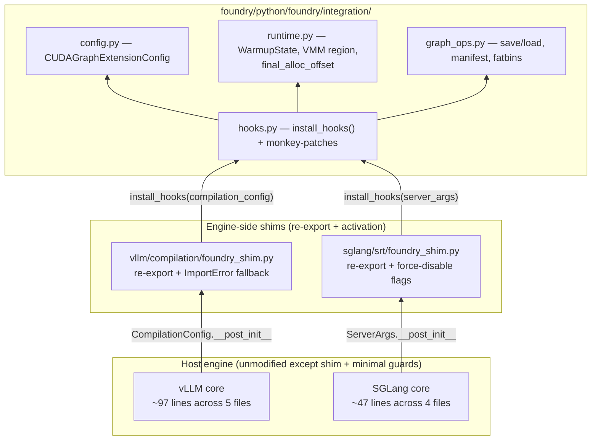

# Foundry Inference-Engine Integrations

Foundry ships two inference-engine integrations that wrap an unmodified serving stack with cold-start graph persistence:

| Engine | Integration code | Documentation |
|---|---|---|
| vLLM | `foundry/python/foundry/integration/vllm/` | [`vllm/overview.md`](vllm/overview.md) |
| SGLang | `foundry/python/foundry/integration/sglang/` | [`sglang/overview.md`](sglang/overview.md) |

Both follow the same shape: a tiny shim in the host engine's source tree re-exports `install_hooks(...)` and `get_graph_extension_mode()`, and the shim is called once from the host engine's config object's `__post_init__`. `install_hooks` then installs a small set of runtime monkey-patches that wrap the engine's lifecycle methods. Everything substantive — VMM region setup, graph save/load, warmup skipping — lives in the foundry package.

## Mental model

## What both integrations share

- **SAVE→LOAD cycle.** SAVE runs the full cold-start path once, captures CUDA graphs + kernel fatbins + a warmup-state JSON, and writes them to a per-rank workspace. LOAD restores from the workspace, skipping graph capture and kernel warmup.
- **Deterministic VMM region.** Both integrations call `foundry::set_allocation_region(base_addr, region_size)` before NCCL / distributed init. Every allocation inside the region (model weights, KV pool, attention workspaces, captured-graph alloc events) lands at a byte-deterministic offset, so SAVE and LOAD address the same VMM offsets.
- **`final_alloc_offset` watermark.** SAVE records the final cursor position; LOAD preallocates the same range via a single `cuMemCreate+cuMemMap`, then bump-allocates within it.
- **Manifest-driven graph load.** Captured graphs are grouped into topology equivalence classes; one graph per group is built as a *template* and the rest become *on-demand* graphs that share the template's executor via per-graph node updates.
- **Spawn-time `LD_PRELOAD`.** `libcuda_hook.so` must be in `LD_PRELOAD` before any CUDA call so its `cuMemAlloc_v2` / `cuModuleLoad*` interposers run in every process. The integrations set the env var before child spawn; the serve scripts also export it from the shell as defense-in-depth.

## What differs between the two

| Aspect | vLLM | SGLang |
|---|---|---|
| Graph capture seam | `CUDAGraphWrapper.__call__` (per piecewise wrapper) | `CudaGraphRunner.capture` (centralized full-graph) |
| Pre-graph warmup | `kernel_warmup`, `_dummy_run`, sampler warmup | `kernel_warmup` + 2 in-place warmup forwards inside `capture_one_batch_size` |
| Profile forward | yes (`memory_profiling` runs full forward) → two-pass SAVE required | no (only `_profile_available_bytes` samples free memory) → single-pass SAVE |
| Compile interaction | `torch.compile` integrated; disabled on LOAD via `do_not_compile=True` | `torch.compile` is the piecewise path; force-disabled via `disable_piecewise_cuda_graph=True` |
| Per-bs metadata | allocated **inside** captured graph (recorded as alloc events) | allocated **outside** captured graph (FlashInfer wrappers) → pre-pass init + `reuse_pre_pass_init` shim needed |
| MoE / EP | first-class with `moe.py` (quant metadata, DeepEP fabric, NVSHMEM) | coming soon |
| Process model | uniproc / MP / Ray executors | `spawn`-based `mp.Process`; needs per-child `install_hooks` |
| Direct edits in host repo | 5 files, ~97 lines | 4 files, ~47 lines |

The per-engine `overview.md` pages explain those differences in detail and how to use each integration.

## Reading order

- New to the integrations: read `vllm/overview.md` or `sglang/overview.md` end-to-end.
- Debugging a SAVE↔LOAD bug: read `vllm/memory-consistency.md` or `sglang/memory-consistency.md`.
- Porting to a new engine: this file + `<engine>/direct-edits.md` + `<engine>/hooks.md` show the minimal contract.
