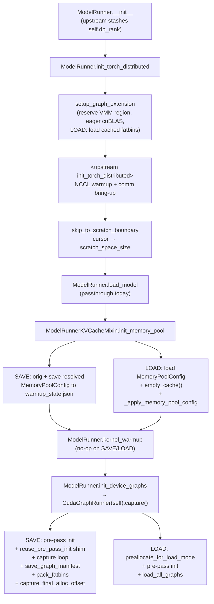

# SGLang Memory & Pool Lifecycle

## The invariant

**SAVE and LOAD must walk an identical VMM cursor trajectory** from `setup_graph_extension` through end-of-capture / end-of-load. Anything that allocates on one path but not the other shifts the cursor by some amount. The captured graph kernels reference VMM addresses fixed at SAVE time; if LOAD's allocations don't land at those exact offsets, the buffers the kernels read are unmapped or contain stale data — **silently**, with no foundry-side error.

## TOML config schema

```toml
mode               = "save" | "load"        # required
base_addr          = 0x600000000000          # required; start of VMM region
region_size        = "256GB"                 # required; total VMM reservation
workspace_root     = "foundry_archive_…"     # required; on-disk workspace
scratch_space_size = "1024MB"                # required; pre-deterministic scratch budget

hook_library_path  = "…/libcuda_hook.so"     # optional; auto-discovered
nvshmem_host_path  = "…/libnvshmem_host.so"  # optional; for EP parity
```

- `base_addr` must be high enough not to collide with model weights or PyTorch's default heap. `0x600000000000` is a safe pick on x86_64.
- `region_size` must exceed `final_alloc_offset` for the model + KV pool + graphs. 256 GiB is generous for a 14 B model.
- `scratch_space_size` should be larger than the sum of NCCL workspace, cuBLAS workspace, and any other one-time allocations that aren't deterministic across runs.
- `workspace_root` is shared across ranks; per-rank artifacts go in `workspace_root/rank_{N}/`. Delete `workspace_root` before any SAVE.

## Lifecycle



## Allocation buckets

### Bucket A — pre-deterministic scratch

CUDA context, cuBLAS handle, NCCL warmup, distributed bring-up. These run **inside** the VMM region but are released by `skip_to_scratch_boundary` — the cursor is forced to `cfg.scratch_space_size` regardless of what landed below it. Any non-determinism in this region is invisible to the rest of the lifecycle.

### Bucket B — deterministic runtime state

Model weights, KV pools, attention workspace buffers, FlashInfer wrapper `_int_workspace_buffer`s, captured-graph alloc events. These must allocate in identical order on SAVE and LOAD. Their final cursor position is the `final_alloc_offset` persisted to `warmup_state.json`.

### Bucket C — forbidden divergence

Anything that runs on one path but not the other. The fixes we landed identify and align the three known cases:

1. The two pre-capture warmup forwards in `capture_one_batch_size` — skipped on SAVE so they don't pollute the caching allocator with freed activations LOAD can't reproduce. (See doc 06.)
2. The per-iter inner `init_forward_metadata_capture_cuda_graph(bs)` call — replaced on SAVE with `reuse_pre_pass_init` so it doesn't re-allocate the wrappers the pre-pass already built. (See doc 03 / doc 05.)
3. `_resolve_memory_pool_config` calls `get_available_gpu_memory(empty_cache=True)` on SAVE; LOAD's `_patch_init_memory_pool` mirrors it with an explicit `torch.cuda.empty_cache()` before `_apply_memory_pool_config`. (See below.)

## The `_resolve_memory_pool_config` mirror

`init_memory_pool` on SAVE calls `_resolve_memory_pool_config` → `_profile_available_bytes` → `get_available_gpu_memory(...)` which calls `torch.cuda.empty_cache()` (`sglang/srt/utils/common.py`). `empty_cache` releases torch caching-allocator segments back to the driver via `cuMemFree_v2`, which the foundry hook unmaps.

LOAD skips upstream `init_memory_pool` and goes straight to `_apply_memory_pool_config`, so it had no equivalent drain. Caching-allocator segments retained on LOAD changed which torch.empty calls hit cache vs. miss during the subsequent attention-backend init — pushing the cursor 20 MB behind SAVE by the time `capture()` was reached.

The fix is one line:

```python
torch.cuda.empty_cache()  # mirror SAVE's _resolve_memory_pool_config side effect
self._apply_memory_pool_config(self.memory_pool_config)
```

## Why saving raw memory numbers isn't enough

The pool config is computed from a profile and a configurator:

1. `_profile_available_bytes(pre_model_load_memory)`
2. `MemoryPoolConfigurator.calculate_pool_sizes(...)`
3. `_apply_token_constraints(...)` (user caps, page alignment, PP sync)
4. `_resolve_max_num_reqs(...)`
5. `_apply_memory_pool_config(...)`

Persisting the resolved `MemoryPoolConfig` (via `dataclasses.asdict`) and re-applying it on LOAD is necessary and sufficient. Persisting raw free-memory numbers would re-run the configurator on LOAD with stale inputs.

`WarmupState.memory_pool_config` is exactly this dict.

## VMM region setup

`setup_graph_extension` (in `runtime.py`):

- Computes the per-rank workspace path (`{workspace_root}/rank_{compute_workspace_rank(...)}`)
- On SAVE: removes the rank workspace if it exists, then creates it fresh
- On LOAD:
    - `cge.set_skip_fatbin_processing(True)`
    - `cge.load_cuda_modules_and_libraries(workspace_dir)` — restores the fatbins SAVE wrote, into device code memory
- `cge.set_allocation_region(cfg.base_addr, parse_size(cfg.region_size))` — reserves a VMM address range; the cursor starts at `base_addr`
- `torch._C._cuda_getCurrentBlasHandle()` — eager cuBLAS handle so the workspace it wants lands in scratch instead of post-scratch territory
- creates the `CUDAGraphExtensionState` singleton

After upstream `init_torch_distributed` returns, `skip_to_scratch_boundary` forces the cursor to `cfg.scratch_space_size` (default 1 GiB). Allocations below that line are scratch and don't need to be deterministic.

## Final watermark

`capture_final_alloc_offset` runs after the SAVE-side capture loop completes (after `save_graph_manifest` and `pack_fatbins`). It writes `final_alloc_offset` to both `rank_{N}/final_alloc_offset.json` and the shared `warmup_state.json`.

`preallocate_for_load_mode` uses this to call `cge.preallocate_region(final - current)` so the entire deterministic range is mapped to physical memory in one shot. The cursor is **not** advanced — preallocate just pre-maps; the cursor advances naturally as cuMemAllocs land within the preallocated range (fast-path: pointer bump, no driver calls).
