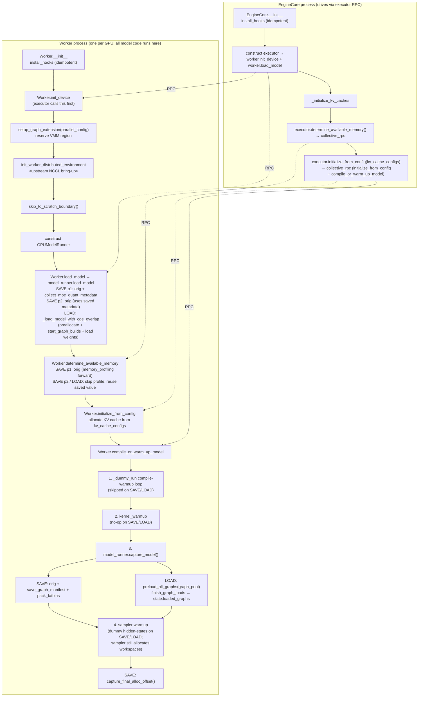

# vLLM Memory & Pool Lifecycle

## The invariant

**SAVE pass 2 and LOAD must walk an identical VMM cursor trajectory** from `setup_graph_extension` through end-of-capture / end-of-load. The captured graph kernels reference VMM addresses fixed at SAVE pass 2 time; if LOAD's allocations don't land at those offsets, kernels read unmapped or stale data — silently, with no foundry-side error.

SAVE pass 1 is a non-deterministic warm-up pass; its job is to write `warmup_state.json` so pass 2 and LOAD can both skip the non-deterministic profile forward.

## Why two-pass SAVE

vLLM's `_initialize_kv_caches` (`vllm/v1/engine/core.py`) runs:

```python
with memory_profiling(...) as profile_result:
    self.model_executor.execute_model(...)         # real forward
```

The forward allocates temporary activations whose total size depends on the model and the caching-allocator state — non-reproducible across runs. The result drives `num_gpu_blocks` / `num_cpu_blocks` for the KV pool. If LOAD re-ran this profile forward, it would land different allocations, drift the cursor, and break every captured graph that references later addresses.

So:

- **SAVE pass 1**: full lifecycle including profile forward. Records `available_gpu_memory`, `num_gpu_blocks`, `num_cpu_blocks`, `moe_quant_metadata` into `warmup_state.json`. Graphs are captured but their `start_base_addr`s carry pass-1-cursor noise.
- **SAVE pass 2**: same code, but the profile forward is skipped (saved values reused). Cursor trajectory is now deterministic. Graphs re-captured; their `start_base_addr`s are reproducible.
- **LOAD**: skip the profile forward (same as pass 2), preallocate up to `final_alloc_offset`, restore captured graphs.

This contrasts with SGLang, which has no profile forward (`_profile_available_bytes` only samples free memory). One SGLang SAVE pass is enough.

## TOML config schema

```toml
mode               = "save" | "load"        # required
base_addr          = 0x600000000000          # required
region_size        = "256GB"                 # required
workspace_root     = "foundry_archive_…"     # required
scratch_space_size = "1024MB"                # required

hook_library_path  = "…/libcuda_hook.so"     # optional; auto-discovered
nvshmem_host_path  = "…/libnvshmem_host.so"  # optional; for EP
```

## Lifecycle (engine-core + worker processes)



The Worker process owns the actual model code; the EngineCore process is a thin orchestrator that drives the Worker via `executor.collective_rpc(...)` (dashed arrows). The call order is:

1. Executor construction (called from `EngineCore.__init__`) RPCs `init_device` then `load_model` into the worker.
2. `EngineCore._initialize_kv_caches` RPCs `determine_available_memory` (this is where the `memory_profiling` profile-forward runs, gated by foundry's pass-1 vs pass-2/LOAD branch).
3. `EngineCore._initialize_kv_caches` then calls `executor.initialize_from_config(kv_cache_configs)`, which itself RPCs two things into the worker back-to-back: `Worker.initialize_from_config` (KV cache allocation) and `Worker.compile_or_warm_up_model`.
4. `compile_or_warm_up_model` runs four phases internally: the `_dummy_run` compile-warmup loop (skipped on SAVE/LOAD), `kernel_warmup` (no-op on SAVE/LOAD), `model_runner.capture_model()` (foundry-backed save / preload), and the sampler warmup (uses a dummy hidden-state tensor on SAVE/LOAD so the sampler workspaces still allocate without re-running the model forward).

Under `UniprocExecutor` (single-GPU) the two "processes" share an address space; under `MultiprocExecutor` / Ray they are genuinely separate. `install_hooks` runs in both processes so foundry's patches are present wherever a `CUDAGraphWrapper.__call__` happens.

## Allocation buckets

### Bucket A — pre-deterministic scratch

CUDA context, cuBLAS handle, NCCL warmup, all-reduce. Reside in the VMM region but erased by `skip_to_scratch_boundary`. Non-determinism here is invisible to the rest of the lifecycle.

### Bucket B — deterministic runtime state

Model weights, KV cache, comm buffers (when prepared inside the deterministic region), captured-graph alloc events. These must allocate in identical order on SAVE pass 2 and LOAD. `final_alloc_offset` is the watermark at the end.

### Bucket C — forbidden divergence

Anything that runs on one path but not the other:

1. **Profile forward** — runs on SAVE pass 1; skipped on pass 2 and LOAD. Saved state bridges the difference.
2. **Compile-warmup `_dummy_run` loop** in `compile_or_warm_up_model` — skipped on SAVE/LOAD.
3. **`kernel_warmup`** — no-op.
4. **Full-forward sampler warmup** — replaced with a dummy hidden-state tensor on SAVE/LOAD; the sampler still runs to populate its workspaces.
5. **Memory-history capture / profiling-only paths** — must stay off.

See [`memory-consistency.md`](memory-consistency.md) for the full list and what each one allocates.

## VMM region setup

`setup_graph_extension(parallel_config)` (in `runtime.py`):

- Computes per-rank workspace path.
- **LOAD**: `cge.set_skip_fatbin_processing(True)` + `cge.load_cuda_modules_and_libraries(workspace_dir)`.
- `cge.set_allocation_region(base_addr, region_size)` — reserves the VMM address range.
- `_eager_init_cublas()` — drags the cuBLAS workspace into scratch.

After upstream NCCL setup, `skip_to_scratch_boundary` forces the cursor to `cfg.scratch_space_size`.

## Warmup state

The shared `warmup_state.json` (workspace root, not per-rank) carries everything needed to bypass the non-deterministic phases on pass 2 / LOAD:

```json
{
  "vllm_version": "...",
  "available_gpu_memory": 73383215104,
  "num_gpu_blocks": 12345,
  "num_cpu_blocks": 0,
  "moe_quant_metadata": {...},
  "final_alloc_offset": 76185530368
}
```

`_patch_initialize_kv_caches` writes it on SAVE pass 1, updates it on SAVE pass 2 (replacing `final_alloc_offset`), and reads it on pass 2 and LOAD.

## `final_alloc_offset` watermark

Captured after `capture_model` finishes on SAVE pass 2 (and updated on pass 1 too — overwritten by pass 2). Written to both `rank_{N}/final_alloc_offset.json` and the shared `warmup_state.json`.

`preallocate_for_load_mode` reads it and calls `cge.preallocate_region(final - current)` to pre-map physical memory for the entire deterministic range. Cursor does not advance; subsequent `cuMemAlloc_v2` calls within the preallocated range fast-path to a pointer bump.

## Per-rank workspace layout

```
foundry_archive_<model>/
  warmup_state.json                       # shared
  rank_0/
    graph_{...}.json + .cugraph           # one pair per captured graph (per BatchDescriptor)
    graph_manifest.json                   # topology groups
    final_alloc_offset.json
    fatbin_image_packed.img
    fatbin_entrypoint_packed.txt
  rank_1/
    …
```

For TP > 1, every rank has its own subdirectory; for EP, ranks may have different `final_alloc_offset`s because different ranks see different experts.

## High-risk seams

| Seam | What can go wrong |
|---|---|
| `_initialize_kv_caches` profile forward | The whole reason for two-pass SAVE. If a future vLLM change adds another non-deterministic call before this point, SAVE pass 2 and LOAD will drift. |
| `compile_or_warm_up_model` | Compile-warmup, kernel_warmup, sampler warmup each need their own skip rule. New warmup phases would need new skip rules. |
| `prepare_communication_buffer_for_model` | The `_comm_buffers_prepared` gate must keep this from re-running on LOAD; double-init would re-allocate at different offsets. |
| `CUDAGraphWrapper.__call__` | If upstream re-writes the capture stanza, the patch needs to track. |

